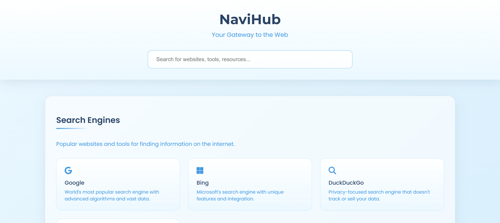

# NaviHub - 你的网络导航中心

> 本项目由 Claude 3.7 Sonnet 大模型自动生成

## 项目简介

NaviHub 是一个简洁优雅的网络导航页面，为用户提供了一个集中管理和快速访问常用网站的平台。项目采用现代化的设计理念，提供了流畅的用户体验和响应式布局。



## 功能特点

- 🔍 集成多个主流搜索引擎
- 🌐 分类展示常用网站链接
- 📱 完全响应式设计，支持各种设备
- 🎨 现代简约的用户界面
- ⚡ 快速加载和流畅的交互体验

## 技术栈

- HTML5
- CSS3 (现代布局 + 响应式设计)
- JavaScript (原生)
- Font Awesome 图标
- Google Fonts

## 部署指南

### 方式一：使用 Cloudflare Pages 部署

1. 注册 [Cloudflare](https://www.cloudflare.com/) 账号
2. 在 Cloudflare Pages 中创建新项目
3. 连接你的 Git 仓库
4. 配置构建设置：
   - 构建命令：不需要（静态网站）
   - 输出目录：/（根目录）
5. 部署完成后，Cloudflare 会自动生成一个域名

### 方式二：使用 GitHub Pages 部署

1. 在 GitHub 上创建新仓库
2. 将代码推送到仓库：
   ```bash
   git init
   git add .
   git commit -m "Initial commit"
   git branch -M main
   git remote add origin https://github.com/你的用户名/NaviHub.git
   git push -u origin main
   ```
3. 在仓库设置中启用 GitHub Pages：
   - 进入仓库的 Settings > Pages
   - Source 选择 main 分支
   - 保存后等待部署完成

## 本地开发

1. 克隆仓库：
   ```bash
   git clone https://github.com/你的用户名/NaviHub.git
   ```
2. 使用本地服务器运行项目，例如：
   - Python：`python -m http.server 8000`
   - Node.js：使用 `live-server` 或其他静态服务器

## 自定义

你可以通过修改以下文件来自定义网站：

- `index.html`：修改网站结构和链接
- `styles.css`：自定义样式和主题
- `script.js`：添加新的交互功能

## 贡献

欢迎提交 Issue 和 Pull Request 来改进这个项目！

## 许可证

[MIT License](LICENSE)

## 致谢

- 本项目由 Claude 3.7 Sonnet 大模型自动生成
- 感谢所有开源项目的贡献者
